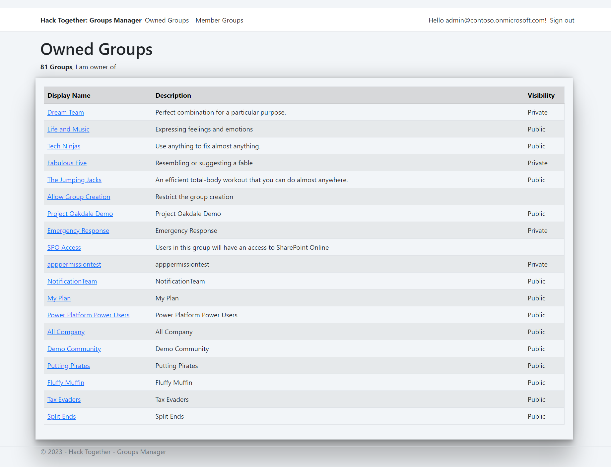

# Hack Together - M365 Groups Manager

[![Hackathon][badge_hackathon]][link_hackathon]

Created for [Microsoft Hack Together](https://github.com/microsoft/hack-together)

## Summary

Office 365 Groups is the foundational membership service, that drives all teamwork across Microsoft 365. Once in a group, we can get the benefits of the group-connected services like shared Outlook inbox, shared calendar, SharePoint site, Planner, Power BI, Yammer, and MS Teams.

This application gives a consolidated view of the Microsoft 365 groups owned by an user, as well they are member of it. This solution will help an individual to manage their group membership better.

## Screenshots

Home page showing the M365 groups owned:

Member Groups page showing the M365 groups, an user is member of:

Clicking the Group name will display additional information of the Group.

## Minimal path to awesome

Follow below steps to use this app:
- Clone this repository
- Create an app registration in Azure AD with the following Microsoft Graph - delegated permissions:
	- Directory.ReadWrite.All
	- User.Read

- Create a client secret for this app registration.
- Update the values to the `AzureAd` section of `appsettings.json` file.
	- `TenantId`: The tenant ID of the Azure AD tenant.
	- `ClientId`: The client ID of the Azure AD application.
	- `ClientSecret`: The client secret of the Azure AD application.

## Authors

* [Nanddeep Nachan](https://github.com/nanddeepn)
* [Smita Nachan](https://github.com/SmitaNachan)

[badge_hackathon]: https://img.shields.io/badge/Microsoft%20-Hack--Together-orange?style=for-the-badge&logo=microsoft
[link_hackathon]: https://github.com/microsoft/hack-together